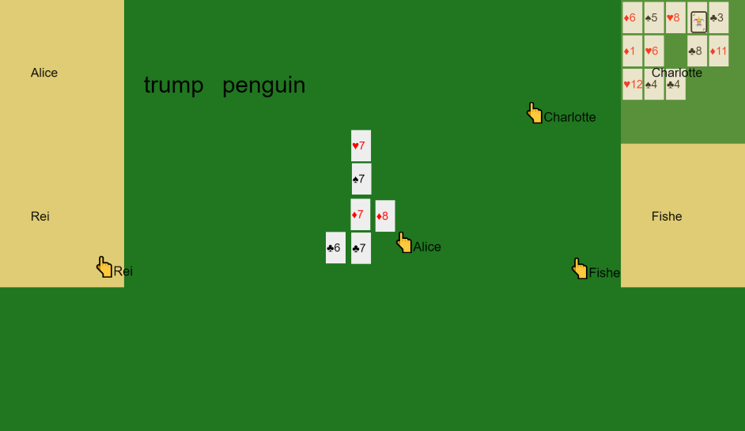
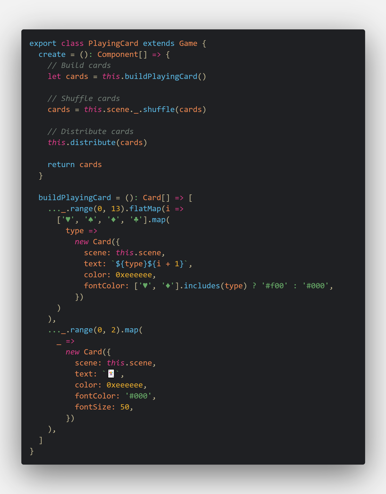

# Tabletop.ts

Tabletop simulator on the [Web](https://tabletop.iwata.love/)



## Concept

- It can easily create a tabletop game with just the components and initialization process.

  ↓ Code of PlayingCard

  

## Architecture

- ゲームは以下の要素によって構成されている
  - 初期化処理（`create()->Components[]`）
  - イベント（`{move(), click()}`）
  - コンポーネント群（`Components[]`）
- ゲームは初期化時にリセットされ、イベント（`event.ts`）の送受信によって状態が共有される
- ゲーム外の状態はColyseusによって共有される（`schema.ts`）

## ToDo

- [ ] 3D
- [ ] Improve UI
- [ ] Make it compatible with [Tabletop Simulator](https://store.steampowered.com/app/286160/Tabletop_Simulator/?l=japanese)
- [ ] Matching room

## 作って分かったこと
- マウスだと操作性に限界がありそう
- 地味なUIと使いづらいUXだと楽しさが半減する

## Structure

```txt
src
├── client
│   ├── Components
│   │   ├── component.ts # コンポーネントの基底クラス
│   │   ├── card.ts # カードゲーム用のカードコンポーネント
│   │   └── ... # いろいろなコンポーネント
│   ├── Games
│   │   ├── game.ts # ゲームの基底クラス
│   │   ├── gameList.ts # ゲームリスト
│   │   └── ... # いろいろなゲーム
│   ├── const.ts # 定数
│   ├── index.ts # クライアントのエントリ
│   ├── event.ts # クライアント間でゲームの状態を共有するためのイベントタイプ
│   └── gamescene.ts # ゲームの管理（クライアント）
├── router.ts # サーバーとクライアントを管理・実行するルーター
├── schema.ts # ゲーム外の状態（プレイヤー情報）などを保持するためのスキーマ（Colyseusによって状態が管理される）
└── server
    └── gameroom.ts # ゲームの管理（サーバー）
```
